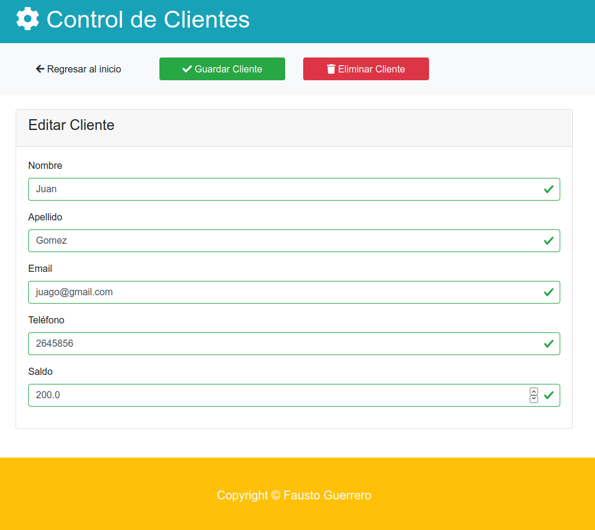

# controlClientesCRUD
<h1>CRUD Control de Clientes. JAVA, JSP, HTML5, CSS, JS, AJAX, BOOTSTRAP, SWEETALERT</h1>

<h2>Menú Principal</h2> 

<h2>Tabla responsive</h2> 

<h2>Cards y footer responsive</h2> 

<h2>Ventana modal Agregar cliente</h2> 

<h2>Editar cliente</h2> 

